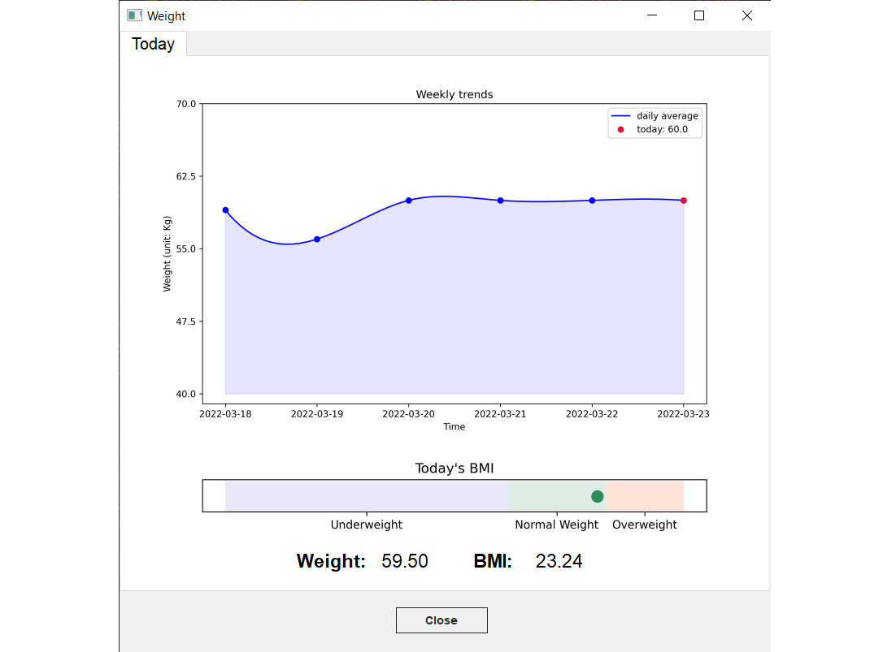

# Edge Computer Desktop Software

This is the source code for implementing the Edge Computer Desktop Software for controlling two IoT devices, receiving data from the Hub (see Hub specification in another markdown). The software is mainly designed for COMP2043 _Software Engineering Group Project_. 

## Installation

#### Influxdb Interface

For Windows users, the package is set already in the folder. 

If you have any problem using the following setup operations please go to [InfluxDB documentation](https://docs.influxdata.com/influxdb/v2.0/install/?t=Windows) and download the zip package. Expand the downloaded archive into the **shh-edge-computer** folder and rename it as influxdb to replace the old folder.

1. Use the following command in your terminal to run the infuxDB database.
```plain
  > cd -Path 'C:\Program Files\InfluxData\influxdb'
  > influxd
```
The first time you open the influxdb database, Windows will pop out a permission dialog, please confirm that you had clicked allow. 

2. With influxDB running, visit [localhost:8086](http://localhost:8086/).
3. Click **Get Started** and set up your initial user.
    1. Enter a **Username** for your initial user.
    2. Enter a **Password** and **Confirm Password** for your user.
    3. Enter your initial **Organization Name**.
    4. Enter your initial **Bucket Name** as **Edge Computer Database**.
    5. Click **Continue**.
    In this step please make sure you remember your account information and set the initial bucket name as Edge Computer Database.

3. Login to your account.
4. click data on the left and slides down. Please click "python" in the client library section. 
5. Once you are on the page to set up the python client, please copy the path, bucket, and org information and paste it into the file "./Controller/database_io/db_path.py". You are asked to replace the old information of these three variables with the new one you have copied. The example style for this information is as follows:
```plain
  token = "2dDe12dTUSnYD6rlbbvuWE_0cqoq1I6Cq9q-Rqb7URzJpRtKm7LPhanU0EZLNaG8PePXXfCTwuv4CccHnN5Znw=="
  org = "UNNC"
  bucket = "Edge Computer Database"
```
6. Press Ctrl + S on your keyboard to make sure you have saved the changes.

### Install python package


Type the package name in the package list one by one and than click the button named "Install Package" once you select the correct package name.

|No.|Package Name|Notes / Acknowledge Sources|
|:----|:----|:----|
|1|pip|install again to upgrade the vision<br>[https://pypi.org/project/pip/](https://pypi.org/project/pip/)|
|2|PyQt5|[https://www.riverbankcomputing.com/software/pyqt/](https://www.riverbankcomputing.com/software/pyqt/)|
|3|paramiko|[https://paramiko.org/](https://paramiko.org/)|
|4|pandas|[https://pandas.pydata.org/](https://pandas.pydata.org/)|
|5|influxdb-client|[https://github.com/influxdata/influxdb-client-python](https://github.com/influxdata/influxdb-client-python)|
|6|portalocker|[https://github.com/WoLpH/portalocker](https://github.com/WoLpH/portalocker)|
|7|matplotlib|[https://matplotlib.org/](https://matplotlib.org/)|
|8|scipy|[https://scipy.org/](https://scipy.org/)|
|9|qasync|[https://github.com/CabbageDevelopment/qasync](https://github.com/CabbageDevelopment/qasync)|
|10|bleak|[https://github.com/hbldh/bleak](https://github.com/hbldh/bleak)|
|11|APScheduler|[https://github.com/agronholm/apscheduler](https://github.com/agronholm/apscheduler)|

## Usage

To run the software, you should run the main function after the setups. 

### Binding the hub

To bind a new hub, the first step is to manually setup the client host of the hub in preferences page. The second step is to click the bind button once the "bind" on hub is taped. The software will offer information dialogs to show whether the bind is successful or not. Once the hub is bind to EC, the hub will notice the available sensors is should be connect to. In this case it is ready to work.


### Update function

Update should be used once the once the hub has upload the data to EC. This function is used to download data from vertial machince and store in EC's database.


### Report

Report page is divided into four sections. Before using the report function, please notice that if you do not have enough measurement data, the report will not be produced. Also, please remember to import your height in preferences settings because it is needed for BMI calculate.

#### Health report

This part includes the weekly and monthly report of your resting heart rate, blood pressure, and BMI. 


#### Heart Rate

This part includes the heart rate data in the last hour and last 24 hours.


#### Weight

This part shows the trends of your weight and today's BMI.




#### Blood Pressure

This part displays the value of todays blood pressure.


### Measurement

You are able to measure your weight and blood pressure on the measurement page. For weight measurement, you are allowed to connect your scale as well as manually input your measurement. For Blood pressure measurement, you can only manually input your measurement. Please follow the guildline present in the software to finish your measure. 


